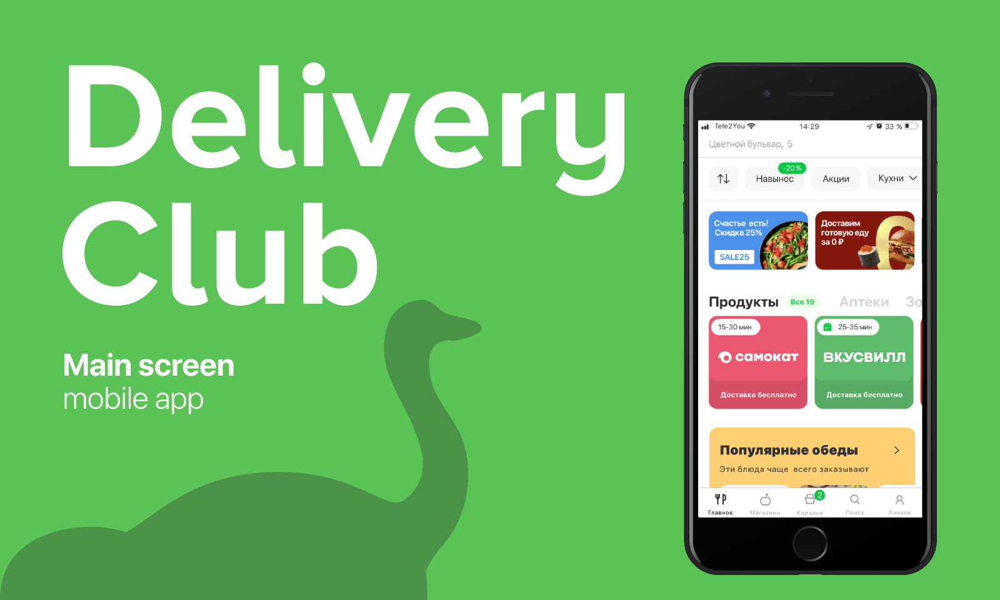

# Sales forecasting
The main goal is to predict sales of products in 10 largest cities for one week.

## Introduction
Sales forecasting allows you to make informed decisions about everything from staffing and inventory to new product lines and potential marketing efforts. 

Here, Machine Learning project was developed for predicting sales across several stores in Delivery Club. The predictions were made with classic ML models (CatBoost and LightGBM). Additionally, I made forecasting of clients (univariate time series) and compared auto regression model (SARIMA) with LSTM.

## Data
Dataframe contained information about the date, weather conditions, product types, stores, and their locations. The history of the sales for previous 7 months is available for delivery shops in 10 cities.  

## Main results
- Compared effectiveness CatBoost and LGBM models for weekly sales prognosis.
- Compared models for univariate time series. SARIMA outperformed LSTM in accuracy and training time.

## Files
- **sales_forecasting.ipynb** - Main notebook with description of the project, code, graphs, and comments.
- **data** - directory, that contains dataframes, used in the project.
    -  **train.csv** - train dataframe, used for training ML models.
    -  **test.csv** - test dataframe, used for predictions.
    -  **public_data.zip** - contains two dataframes (train.csv and test.csv) in a single zipfile.

